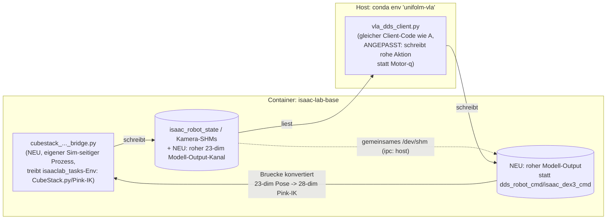

# GR00T vs. UniFolm-VLA: Architektur- und Modellvergleich

Vergleich der beiden Closed-Loop-Eval-Setups fuer G1-Manipulation in Isaac Lab -- NVIDIA
GR00T N1.7 (Referenz Korb ausladen) vs. UniFolm-VLA (Cube Stacking). Ergaenzt
`cube_stack_eval_env.md` (dort die Detail-Debug-Historie der Cube-Stack-Envs) um eine
fokussierte Gegenueberstellung der beiden Kommunikationsarchitekturen UND der beiden
Modelle/Aktionsformate.

---

## 0. Drei Setups im Ueberblick

Bevor die naechste Implementierung (Pink-IK-Bruecke fuer Isaac Sim + UniFolm-VLA)
angegangen wird, hier alle drei bisher relevanten Architekturen nebeneinander -- was
laeuft wo, wer redet mit wem, und was ist jeweils der Unterschied.

### A) Unitree Sim (`unitree_sim_isaaclab`) + UniFolm-VLA -- die bereits bestehende Referenz

```mermaid
flowchart LR
  subgraph C1["Container: unitree-sim (eigenes Image)"]
    SM["sim_main.py<br/>(unitree_sim_isaaclab eigenes<br/>Task-/Env-Framework, z.B.<br/>Isaac-Stack-RgyBlock-G129-Dex3-Joint)"]
    SM -->|schreibt| SHM1[("isaac_*_image_shm<br/>isaac_robot_state<br/>isaac_dex3_state")]
    SHM1 -.gemeinsames /dev/shm.-> SHM2
    SHM2[("dds_robot_cmd<br/>isaac_dex3_cmd")] -->|liest, wendet an ueber<br/>action_provider_dds.py| SM
  end
  subgraph H1["Host: conda env 'unifolm-vla'"]
    VC["vla_dds_client.py"]
  end
  SHM1 -->|liest| VC
  VC -->|schreibt Motor-q-Werte<br/>(nimmt Joint-Space an)| SHM2
```

- Sim-Framework: **unitree_sim_isaaclab's eigenes** Task-System (nicht `isaaclab_tasks`),
  gestartet per `sim_main.py --enable_dex3_dds --task Isaac-Stack-RgyBlock-G129-Dex3-Joint`.
- Kommunikation: SHM (trotz "dds"-Namen keine echte DDS-Kommunikation zwischen Sim und
  Client -- nur INNERHALB des Sim-Containers wird `unitree_sdk2py` fuer die
  Nachrichten-STRUKTUR/-Typen benutzt, der eigentliche Sim<->Client-Kanal ist plain SHM).
  Zwei unabhaengige Prozesse, kein Request/Response.
- Sim-native Action-Space: rohe Gelenkwinkel ueber ALLE Gelenke
  (`JointPositionActionCfg(joint_names=[".*"])` in
  `stack_rgyblock_g1_29dof_dex3_joint_env_cfg.py`).
- **Bekannter Konstruktionsfehler (gefunden waehrend dieser Session, siehe
  `cube_stack_eval_env.md`):** `vla_dds_client.py` schreibt IMMER unnormalisierte
  Modell-Werte direkt als Motor-`q` (=Gelenkwinkel), unabhaengig davon, ob der geladene
  Checkpoint wirklich Gelenkwinkel vorhersagt. Fuer einen Pose-Space-Checkpoint (wie
  `UnifoLM-VLA-Base`/`g1_stack_block`, 23-dim) ist das genauso falsch verdrahtet wie in
  unserem eigenen Aufbau (B) -- dieser Bug ist NICHT spezifisch fuer unsere neue Bruecke,
  er steckt in der Referenz-Pipeline selbst.

### B) Isaac Sim (plain IsaacLab) + GR00T -- bereits fertig & korrekt verdrahtet

```mermaid
flowchart LR
  subgraph C2["Container: isaac-lab-base"]
    EV["eval_referenz_korb_ausladen.py<br/>(EIN Prozess: Sim + Eval-Loop<br/>im selben Python-Prozess)"]
  end
  subgraph H2["Host: conda env 'Isaac-GR00T'"]
    GS["run_gr00t_server.py<br/>(GR00T N1.7 Policy Server)"]
  end
  EV <-->|ZMQ REQ/REP<br/>Observation rein, Action-Chunk raus<br/>(synchron, blockierend)| GS
```

- Ein einziger Prozess (im Container) treibt Env UND Eval-Schleife direkt an
  (`run_episode()` ruft `env.step()` selbst auf).
- Kommunikation: ZMQ, synchrones Request/Response, `--action_horizon`-Chunking explizit
  im Eval-Script durchiteriert.
- Action-Space: Pink-IK 28-dim (6D-Pose+Quaternion x2 Arme + 14 rohe Fingerziele) --
  **purpose-built**: GR00T wurde extra fuer genau dieses Aktionsformat/diese Env
  feingetunt, kein Formatbruch, kein Konvertierungscode noetig.
- Episoden/Reset/Erfolg/Video: alles in diesem EINEN Script.

### C) Isaac Sim (plain IsaacLab) + UniFolm-VLA -- was wir gerade bauen



- Sim-Framework: unser eigener `isaaclab_tasks`-Gym-Env (`CubeStack.py`, Dex3+Pink-IK) --
  **kein** unitree_sim_isaaclab-Framework, daher **eigene** Bruecke statt `sim_main.py`
  (der Grund, warum diese Bruecke ueberhaupt neu geschrieben werden musste).
- Kommunikation: SHM, gleiches Grundmuster wie (A) -- ABER: (A)s vorhandene
  `dds_robot_cmd`/`isaac_dex3_cmd`-Kanaele sind auf Motor-Gelenkwinkel zugeschnitten
  (Feldname `q`, Mapping auf `ARM_JOINT_TARGET_INDICES`). Da unser Checkpoint
  nachweislich (`action dim: 23`) Pose-Space ausgibt, braucht es einen NEUEN,
  einfachen Rohdaten-Kanal (unnormalisierte 23 Floats, kein Motor-Mapping) statt diese
  Kanaele zweckzuentfremden.
- Action-Space: **kein natives Match** -- anders als (B) wurde dieser Checkpoint nicht
  fuer unsere Pink-IK-Env trainiert. Die Bruecke muss daher selbst konvertieren:
  6D-Rotation->Quaternion (Gram-Schmidt+Kreuzprodukt), Greifer-Skalar->7 Fingerziele je
  Hand (Interpolation, Approximation), Taille verwerfen (Pink-IK nimmt sie ohnehin nicht
  als Eingang). Diese Konvertierung existiert in KEINEM der beiden anderen Setups.

### Kernunterschiede auf einen Blick

| | A) Unitree Sim + UniFolm-VLA | B) Isaac Sim + GR00T | C) Isaac Sim + UniFolm-VLA |
|---|---|---|---|
| Sim-Framework | unitree_sim_isaaclab (eigen) | isaaclab_tasks (unser Env) | isaaclab_tasks (unser Env) |
| Sim-seitiges Script | `sim_main.py` (vorhanden) | `eval_referenz_korb_ausladen.py` (unser Script, treibt alles) | neue Bruecke (unser Script, nur Sim-Seite) |
| Transport | SHM | ZMQ | SHM |
| Prozess-Modell | 2 unabhaengige Prozesse | 1 Prozess (Sim=Eval-Loop) + Remote-Server | 2 unabhaengige Prozesse |
| Action-Space-Match | Unklar/moeglicherweise falsch (s.o.) | Perfekt (purpose-built) | Kein Match -- braucht Konvertierung |
| Client-Code | `vla_dds_client.py` Original | Eingebetteter ZMQ-Client (kein externes Package) | `vla_dds_client.py`, angepasst (roher Kanal statt Motor-q) |

---

## 1. Kommunikationsarchitektur

|  | **GR00T** (`eval_referenz_korb_ausladen.py`) | **UniFolm-VLA** (`cubestack_jointspace_unifolm_vla_bridge.py` + `vla_dds_client.py`) |
|---|---|---|
| Transport | ZMQ (REQ/REP, msgpack, Netzwerk-Socket) | `multiprocessing.shared_memory` (`/dev/shm`) |
| Muster | Synchrones Request/Response (RPC) | Asynchrones Publish/Poll (kein Request/Response) |
| Wer kontrolliert die Schleife | Der Eval-Script selbst (`run_episode`), ruft aktiv beim Server ab | Zwei unabhaengige Prozesse, keiner "wartet" auf den anderen -- jeder liest/schreibt in seinem eigenen Takt |
| Action-Chunking | Explizit (`--action_horizon`, mehrere Aktionen pro Server-Call, im Eval-Script durchiteriert) | Kein Chunking -- eine Aktion pro Bruecken-Loop-Iteration, "frisch" ist, was der Client zuletzt geschrieben hat |
| Episoden/Reset/Erfolg/Video | Alles im EINEN Eval-Script (`run_episode`, `--num_episodes`, `save_video`) | Aufgeteilt: Bruecke haelt Reset-/Video-Logik, Client weiss nichts von Episoden |
| Warum dieser Transport | `gr00t`-Package liess sich nicht einfach im IsaacLab-Container installieren -> minimaler ZMQ-Client nachgebaut, der `gr00t.policy.server_client.PolicyServer`s Protokoll spricht | Uebernommene Konvention aus der bereits bestehenden `unitree_sim_isaaclab` + `vla_dds_client.py`-Deployment-Pipeline (fuer den echten Roboter/`sim_main.py` gebaut) -- eigene Bruecke im SELBEN Wire-Format nachgebaut, damit `vla_dds_client.py` UNVERAENDERT laeuft |
| Cross-Host-faehig | Ja (TCP, GR00T-Server lief auf dem Host, Eval im Container) | Nein -- SHM ist lokal; brauchte `ipc: host` auf dem `isaac-lab-base`-Container, um mit dem Host-Prozess ueberhaupt zu kommunizieren (siehe `cube_stack_eval_env.md`, Docker-Rebuild-Historie) |

**Praktische Konsequenz:** ZMQ liefert klare Episodengrenzen und explizites Action-Chunking
quasi kostenlos mit (das Eval-Script entscheidet, wann ein neuer Chunk angefordert wird).
Der SHM-Ansatz ist entkoppelt und niedriglatenter, aber "Aktionsfrische" ist bloss "was der
Client zuletzt geschrieben hat" -- das hat im Debugging mehr bewegliche Teile erzeugt
(Proprio-Zusammensetzung, Joint-Reihenfolge, `ipc: host`-Fix, s.u.) als beim ZMQ-Pfad
noetig war.

---

## 2. Modell / Aktionsformat

Der eigentliche Unterschied liegt aber nicht in der Transportschicht, sondern im
**Aktionsformat der beiden Modelle** -- und hier gab es waehrend der Entwicklung einen
echten Irrtum, der erst durch einen Live-Test aufgedeckt wurde.

|  | **GR00T N1.7** (Referenz Korb ausladen) | **UniFolm-VLA** (`g1_stack_block`, `UnifoLM-VLA-Base`) |
|---|---|---|
| Aktionsraum | Pose-Space -- Pink-IK-basiert | Pose-Space -- **ebenfalls**, aber anderes Encoding |
| Dimensionen | 28: `left_arm`(7=pos3+quat4) + `right_arm`(7) + `left_hand`(7 rohe Fingerziele) + `right_hand`(7) | **23** (per Live-Check bestaetigt: `Model action dim: 23 \| proprio dim: 23`): `left_xyz`(3) + `left_rot6d`(6) + `right_xyz`(3) + `right_rot6d`(6) + `waist5`(5, buendelt Taille + beide Greifer-Skalare) |
| Rotationsdarstellung | Quaternion (w,x,y,z) | "6D"-Rotation (Zhou et al., kontinuierliche Repraesentation) -- de facto die ersten zwei Spalten der RPY-abgeleiteten Rotationsmatrix (siehe `prepare_data/hdf5_to_rlds/rlds_dataset/rlds_dataset.py::batch_pose17_to_pose23`), NICHT direkt vergleichbar mit Quaternion, aber via Gram-Schmidt + Kreuzprodukt eindeutig in eine Rotationsmatrix/Quaternion umrechenbar |
| Greifer | 7 rohe Fingergelenkziele pro Hand (kein einzelner Skalar) | 1 Skalar pro Hand (in `waist5` gebuendelt) -- muss auf 7 Dex3-Fingerziele pro Hand zurueckgerechnet werden (z.B. lineare Interpolation zwischen einer Offen- und einer Geschlossen-Referenzhaltung) |
| Wer macht die IK | `PinkInverseKinematicsActionCfg` (Pink-Solver) **innerhalb** der IsaacLab-Env selbst | Noch zu klaeren/bauen -- siehe Abschnitt 3 |

### Der Irrtum und seine Aufklaerung (chronologisch)

1. **Erste Recherche** (generischer Repo-Code, `oxe/configs.py`): `g1_stack_block` ist auf
   das `EE_R6_G1`-Pose-Encoding registriert (23-dim) -- **richtig**, wie sich spaeter
   zeigte, aber zu diesem Zeitpunkt nicht vertrauenswuerdig verifiziert.
2. **Nutzer-Korrektur**: "UniFolm VLA arbeitet auch beim Dex3 im Joint Space" --
   Gegenrecherche in den tatsaechlichen LeRobot-Datensatz-Metadaten (`info.json`) zeigte
   28-dim `observation.state`/`action` mit expliziten Gelenknamen (14 Arm + 14
   Dex3-Finger, keine Taille). Das liess den Joint-Space-Pfad plausibel erscheinen -- ABER
   das ist nur das RAW-Speicherformat des Trainingsdatensatzes, nicht notwendigerweise das,
   was das MODELL tatsaechlich lernt/vorhersagt.
3. **Fehler:** Auf Basis von (2) wurde `fixed_base_upper_body_ik_g1_env_cfg_CubeStack_JointSpace.py`
   gebaut (28-dim Joint-Space-Actionterm, `preserve_order=True`, exakte
   Datensatz-Gelenkreihenfolge) und `vla_dds_client.py`/`tools/shared_memory_utils.py`
   entsprechend gefixt (Hand-Kommando-Luecke, Proprio-Bug, hartcodierter 3-Kamera-Reader --
   diese 3 Fixes bleiben unabhaengig davon gueltig und sinnvoll, siehe unten).
4. **Live-Beweis (endgueltig):** Beim tatsaechlichen Checkpoint-Start meldet
   `vla_dds_client.py`: `Model action dim: 23 | proprio dim: 23`. Der reale, geladene
   Checkpoint (`UnifoLM-VLA-Base`, `unnorm_key=g1_stack_block`) nutzt also **doch** das
   23-dim EE-Pose-Format aus Schritt 1 -- die RLDS-Trainings-Pipeline transformiert die
   rohen 28-dim Gelenk-Aufzeichnungen VOR dem Training in dieses Pose-Format
   (`unitree_g1_ee_6d_dataset_transform` in `transforms.py`, angewendet auf Daten, die per
   `batch_pose17_to_pose23` in `rlds_dataset.py` erzeugt wurden). Schritt (2)s Datensatz-
   Metadaten beschreiben also nur das Speicherformat VOR dieser Transformation, nicht das,
   was das Modell tatsaechlich sieht/vorhersagt.

**Lehre:** Bei mehrstufigen Daten-Pipelines (Roh-Aufzeichnung -> Transform -> Modell-I/O)
reicht die Pruefung EINER Stufe nicht aus. Nur der Live-Check des tatsaechlich geladenen
Checkpoints (`action dim`/`proprio dim` im Server-Log) ist hier autoritativ.

### Was trotzdem gueltig bleibt

Die drei in `vla_dds_client.py`/`tools/shared_memory_utils.py` gefundenen und behobenen
Bugs sind vom Joint-Space/Pose-Space-Irrtum UNABHAENGIG und bleiben fuer JEDE Nutzung
dieses Clients relevant:
- Hand-Kommandos wurden nirgends angewendet (fehlender `isaac_dex3_cmd`-Schreibpfad).
- `MultiImageReader` hatte `['head','left','right']` hartcodiert, ignorierte `--image_order`.
- (Die Proprio-Bug-Fix (`_compose_dex3_proprio`) war spezifisch fuer den 28-dim-Pfad
  gedacht und muesste fuer den tatsaechlichen 23-dim-Pfad neu geschrieben werden --
  s. Abschnitt 3.)

---

## 3. Aktueller Stand & naechste Schritte

**Entscheidung (Nutzer):** Auf die bereits vorhandene, per Teleop getestete Pink-IK-Env
(`fixed_base_upper_body_ik_g1_env_cfg_CubeStack.py`, Dex3 + Pink-IK) umschwenken, statt
eine eigene 23-dim-Pose-fahige IsaacLab-Env neu zu bauen. Es braucht stattdessen:

1. Eine Konvertierung im Bridge-/Client-Code: 23-dim UniFolm-VLA-Output ->
   28-dim Pink-IK-Actionformat:
   - `[L_xyz(3), L_rot6d(6)]` -> Quaternion via Gram-Schmidt-Orthonormalisierung der
     beiden 6D-Spalten + Kreuzprodukt fuer die dritte Achse, dann Rotationsmatrix ->
     Quaternion.
   - `waist5`s 2 Greifer-Skalare -> je 7 rohe Dex3-Fingerziele (z.B. lineare Interpolation
     Offen<->Geschlossen-Referenzhaltung).
   - `waist5`s 3 Taille-Werte -> vermutlich direkt als Taille-Gelenkwinkel (unklar ob
     Pink-IK das ueberhaupt als Aktionseingang akzeptiert oder intern fixiert -- pruefen).
2. **Geklaert (per nachgeladenem `televuer`-Submodule, vorher nicht ausgecheckt):**
   - **Koordinatensystem:** `tv_wrapper.py::TeleVuerWrapper.get_tele_data()` gibt
     `left_wrist_pose`/`right_wrist_pose` explizit relativ zur TAILLE zurueck
     (Kommentar: *"The origin of the coordinate for IK Solve is near the WAIST joint
     motor... translate the origin from HEAD to WAIST"*) -- passt 1:1 zu Pink-IKs
     `LocalFrameTask(base_link_frame_name=".../pelvis")`. Keine Frame-Konvertierung
     noetig.
   - **`waist5`-Sub-Reihenfolge:** durch Abgleich der Writer-Code-Konkatenation in
     `convert_lerobot_to_hdf5.py:71,77` (`[left_ee(6), right_ee(6), right_gripper(1),
     left_gripper(1), waist(3)]`) mit `batch_pose17_to_pose23`s 17->23-dim-Expansion
     ergibt sich im finalen 23-dim Output: Index 18 = **rechter** Greifer-Skalar, Index 19
     = **linker** Greifer-Skalar, Index 20-22 = Taille. (Das tfds-Docstring in
     `rlds_dataset.py`, das "links dann rechts" behauptet, ist schlicht veraltet/falsch --
     der tatsaechliche Schreib-Code ist massgeblich.)
   - **Vereinfachung:** Pink-IKs `PinkInverseKinematicsActionCfg` nimmt gar keine
     Taille als Aktions-Eingang entgegen -- die Taille wird intern ueber
     `NullSpacePostureTask` geloest. Die Taille-Werte (Index 20-22) aus dem
     Modell-Output koennen fuer die Konvertierung schlicht verworfen werden.

3. **Bleibt eine Approximation (nicht rekonstruierbar):** die exakte Formel, die beim
   Trainings-Datensatz reale Dex3-Fingerwinkel auf einen einzelnen Greifer-Skalar
   reduziert hat (das entsprechende Konvertierungs-Repo liegt nicht in diesem Checkout).
   Geplanter Ersatz: lineare Interpolation zwischen einer Offen- und einer
   Geschlossen-Referenzhaltung je Hand -- muss empirisch validiert werden, sobald ein
   Testlauf beobachtbar ist.

**Naechster Schritt:** neue Bruecke fuer die Pink-IK-Env bauen (siehe Diskussion mit dem
Nutzer fuer die konkrete Architektur), die den rohen 23-dim Modell-Output liest und in das
28-dim Pink-IK-Aktionsformat konvertiert (6D-Rotation->Quaternion via Gram-Schmidt +
Kreuzprodukt, Greifer-Skalar->7 Fingerziele je Hand, Taille verwerfen).
