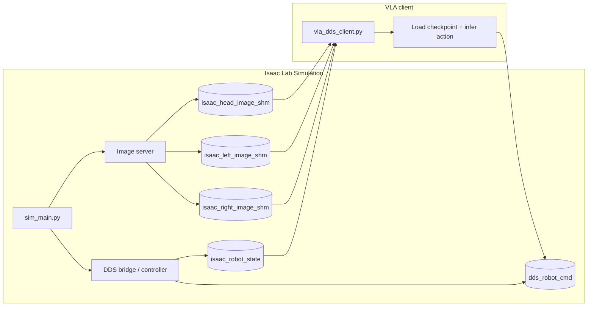

**Architecture Overview**

- **Repositories involved:**
  - **`unitree_sim_isaaclab`**: Isaac Lab simulation, image server and DDS bridge that creates and publishes shared-memory endpoints (e.g. `isaac_head_image_shm`, `isaac_robot_state`) and listens to DDS channels such as `rt/reset_pose/cmd`.
  - **`unifolm-vla`**: VLA inference code and checkpoints. The client process is `deployment/isaaclab_bridge/vla_dds_client.py` which reads SHMs, runs the model, and writes actions to `dds_robot_cmd`.
  - **`xr_teleoperate/teleop/teleimager`** (or the sim's `teleimager` submodule): image server code used by the sim to publish camera frames into SHMs.
  - **`unitree_sdk2_python` / `unitree_sdk2py`**: DDS/SDK utilities used for publishing/subscribing to DDS topics (used by `reset_pose_test.py` and the sim DDS bridge).
  - External/optional repos: **`UnifoLM-VLA-*` checkpoints** (model weights), **`LIBERO`** (alternative sim tasks), and **`unitree_deploy`** (real‑robot deployment client).

- **Component responsibilities & dataflow:**
  - **Simulator (`unitree_sim_isaaclab`)**: starts the image server and DDS bridge; writes camera images to SHMs (`isaac_*_image_shm`) and robot state to `isaac_robot_state`; reads `dds_robot_cmd` to apply motor commands; listens to DDS `rt/reset_pose/cmd` and writes `isaac_reset_pose_cmd` SHM (or directly applies resets).
  - **Image Server (`teleimager`)**: captures/renders camera frames and writes them into named SHMs the client reads.
  - **VLA Client (`unifolm-vla/deployment/isaaclab_bridge/vla_dds_client.py`)**: reads images and `isaac_robot_state` using `dds.sharedmemorymanager`/`tools.shared_memory_utils`, runs `UnifoLM-VLA` model, writes resulting action dict into `dds_robot_cmd` SHM for the sim to consume.
  - **Reset publisher (`reset_pose_test.py`)**: publishes reset categories to `rt/reset_pose/cmd` (DDS) — typically executed inside the sim container so `unitree_sdk2py` is available.

- **Interaction patterns & deployment notes:**
  - Start order: Simulation (creates SHMs) → VLA client (attaches to SHMs). If SHMs disappear or are stale, restart the sim.
  - Containerization: run sim in a Docker container with `--ipc=host` (or bind `/dev/shm`) and mount `teleimager`/repo so SHMs are visible to the host client.
  - Permissions: if SHMs are root-owned, fix with `sudo chmod 666 /dev/shm/isaac_*` or run sim with UID matching the host user.

Refer to `deployment/isaaclab_bridge/vla_dds_client.py` for the client implementation and to `unitree_sim_isaaclab/reset_pose_dds.py` & `reset_pose_test.py` for reset publishing examples.


## 🧩 Isaac Lab Bridge Quickstart (Dex1 / Stack Cube)
If you want to run the Isaac Lab simulation with the Dex1 gripper and drive it with the `UnifoLM-VLA-Base` checkpoint, use the following start order:

1. Start the simulation first so it creates the shared-memory endpoints and DDS bridge objects.
2. Start the VLA client second so it can attach to the live `isaac_robot_state`, camera SHMs, and `dds_robot_cmd`.

### Live Scene Reset — Clean Two-Step Guide
You do not need to restart the simulation every time you want to reset the scene. The bridge listens on the DDS channel `rt/reset_pose/cmd` and the sim applies the reset in-process.

Reset categories:

| Category | Effect |
|----------|--------|
| `1` | Reset object |
| `2` | Reset all |
| `3` | Reset assembly |

Environment: simulation env name used in examples is `unitree_sim_env` (prompt: `(unitree_sim_env) root@omniverse-2:/home/code/unitree_sim_isaaclab#`).

Overview — two steps
- Step A (Debug): verify SHMs, camera frames and robot state; run sim and client with logging to confirm data flow.
- Step B (Inference): run normal sim + client for inference and use the container `reset_pose_test.py` to trigger resets.

Step A — Debug / verify SHM transfer
1. Start the simulation (in the sim container). Example container run (one of the previous examples) and then inside the container run the sim:

```bash
# in container shell (example)
cd /home/code/unitree_sim_isaaclab
export PYTHONPATH=/home/code/unitree_sim_isaaclab:$PYTHONPATH
python sim_main.py \
  --device cpu --enable_cameras --camera_write_interval 1 \
  --task Isaac-Stack-RgyBlock-G129-Dex1-Joint --enable_dex1_dds --robot_type g129 --no_render
```

2. Start the VLA client with image-presence logging:

```bash
python deployment/isaaclab_bridge/vla_dds_client.py \
  --ckpt_path /home/omniverse-2/UnifoLM-VLA-Base/checkpoints/pytorch_model.pt \
  --vlm_pretrained_path unitreerobotics/UnifoLM-VLM-Base \
  --instruction "grab the red cube with the left arm" \
  --device cuda --camera_color_space bgr --image_order head left right \
  --log_image_presence --log_image_presence_interval 10
```

Checks while debugging (Step A):
- Sim must print `========= create image server =========` and `create image server success`.
- On the host: `ls -l /dev/shm | egrep 'isaac_head_image_shm|isaac_left_image_shm|isaac_right_image_shm|isaac_robot_state'` should show SHMs.
- Tail client logs for `Image inputs | available=... | missing=...` and `Received first valid sim data` / `Published command` messages.

Common failures and fixes:
- `ModuleNotFoundError: unitree_sdk2py`: run `reset_pose_test.py` inside the sim container (see Step B) or install `unitree_sdk2py` into the host env.
- Permission denied on SHMs (resource_tracker warnings): SHMs may be root-owned — fix with `sudo chmod 666 /dev/shm/isaac_*` or run client in same IPC namespace / as same UID.
- Checkpoint action-dim mismatch: choose compatible checkpoint (e.g., `UnifoLM-VLA-Libero`) or update `action_dim` in your model config.
- No images: ensure observation manager runs (`--camera_write_interval 1`) and camera names in task match `head/left/right`.

Step B — Inference and live reset
1. Start the simulation (same as in Step A but you can remove `--camera_write_interval 1` if not debugging):

```bash
python sim_main.py \
  --device cpu --enable_cameras --task Isaac-Stack-RgyBlock-G129-Dex1-Joint \
  --enable_dex1_dds --robot_type g129 --no_render
```

2. Start the VLA client (inference mode) — exact command you will use:

```bash
python deployment/isaaclab_bridge/vla_dds_client.py \
  --ckpt_path /home/omniverse-2/UnifoLM-VLA-Base/checkpoints/pytorch_model.pt \
  --vlm_pretrained_path unitreerobotics/UnifoLM-VLM-Base \
  --instruction "grab the red cube with the left arm" \
  --device cuda --camera_color_space bgr --image_order head left right
```

3. Trigger a live scene reset from inside the sim container (recommended).

Open a new terminal on the host (start in ~). Two supported ways are shown below — use the interactive flow for manual debugging and the non-interactive one-liner for automation or quick checks.

Interactive (recommended for debugging)

```bash
# from the host (new terminal, e.g. ~)
sudo docker exec -it unitree-sim bash

# when you see the container prompt:
cd /home/code/unitree_sim_isaaclab
# if `conda` is not available in the interactive shell, enable it
source /opt/conda/etc/profile.d/conda.sh  # only needed if conda isn't initialized
conda activate unitree_sim_env

# Examples: trigger the three reset categories interactively
# 1) Reset object
python reset_pose_test.py --category 1

# 2) Reset all
python reset_pose_test.py --category 2

# 3) Reset assembly (default)
python reset_pose_test.py --category 3
```

Non-interactive (single-line, robust)

Preferred (uses `conda run` and absolute path). Examples below show how to publish categories 1,2,3 from the host in one line (no interactive shell):

```bash
# Category 1 (Reset object)
sudo docker exec -it unitree-sim bash -lc "conda run -n unitree_sim_env --no-capture-output python /home/code/unitree_sim_isaaclab/reset_pose_test.py --category 1"

# Category 2 (Reset all)
sudo docker exec -it unitree-sim bash -lc "conda run -n unitree_sim_env --no-capture-output python /home/code/unitree_sim_isaaclab/reset_pose_test.py --category 2"

# Category 3 (Reset assembly)
sudo docker exec -it unitree-sim bash -lc "conda run -n unitree_sim_env --no-capture-output python /home/code/unitree_sim_isaaclab/reset_pose_test.py --category 3"
```

Quick troubleshooting

- "python: can't open file '/home/code/reset_pose_test.py'": you are in /home/code, not /home/code/unitree_sim_isaaclab — either `cd` into the repo or run the script by absolute path as shown above.
- If `conda` is not found inside the container, verify where conda is installed (common path: /opt/conda) and source the corresponding `conda.sh` before activating or use `conda run`.
- If the script is missing, check with:

```bash
sudo docker exec -it unitree-sim ls -l /home/code/unitree_sim_isaaclab/reset_pose_test.py
```

Use the absolute-path one-liner when you want a single reliable command from the host terminal; use the interactive flow when you need to inspect logs or modify files inside the container before running the reset.

Notes
- If bridge or client are restarted, SHMs may be unlinked — restart sim if SHMs are stale.
- Use `--ipc=host` or bind `/dev/shm` to share SHMs between host and container.
- Quick permissions fix on host: `sudo chmod 666 /dev/shm/isaac_head_image_shm /dev/shm/isaac_left_image_shm /dev/shm/isaac_right_image_shm /dev/shm/isaac_robot_state`.


### Simulation
Wenn du bereits ein Start-Pattern für den Container verwendest (z. B. mit deinen Volumes und `-it`), findest du hier drei sichere Varianten und Hinweise zu Problemen, die auftreten können.

Wichtige Voraussetzung für den Sim-Start:
- `teleimager` muss als importierbares Python-Paket verfügbar sein.
- In deinem Setup liegt es bereits hier: `/home/omniverse-2/xr_teleoperate/teleop/teleimager`.
- Wenn der Sim-Container nur das leere Submodule-Verzeichnis hat, schlägt `from teleimager.image_server import run_isaacsim_server` beim Start fehl.
- Deshalb musst du entweder dein vorhandenes `teleimager` mounten oder das Submodule im Sim-Repo initialisieren, bevor du den Sim startest.

Wenn du dein vorhandenes Teleop-Repo nutzt, installiere direkt aus diesem Pfad:

```bash
cd /home/omniverse-2/xr_teleoperate/teleop/teleimager
pip install -e ".[server]"
```

Wenn du stattdessen das Sim-Repo als Quelle nutzen willst, nimm den Submodule-Weg:

```bash
cd /home/code/unitree_sim_isaaclab
git submodule update --init --depth 1
cd teleimager
pip install -e ".[server]"
```

Wenn das Submodule noch nicht einmal gezogen wurde, sollte `teleimager/` danach nicht mehr leer sein.

Warum dein Fehler passiert (Kurzfassung):
- `--user $(id -u):$(id -g)` sorgt dafür, dass Prozesse im Container mit deiner Host-UID laufen. Das ist normalerweise gut, aber viele Container-Images erwarten, dass die UID in `/etc/passwd` existiert; fehlt der Eintrag, erscheint `I have no name!` und einige Tools (z. B. `conda init`) versuchen `sudo` auszuführen oder auf Dateien im Home zuzugreifen, die nicht vorhanden oder nicht schreibbar sind.
- In deinem Log ruft `conda init` `sudo` auf, das in dem Image nicht installiert ist, daher schlägt `conda init` fehl. Außerdem ist das gemountete Repo-Verzeichnis nicht an der erwarteten Stelle im Container, daher `cd /home/omniverse-2/unitree_sim_isaaclab: No such file or directory`.


Option A — Empfohlen (einfach, verlässlich): Asset-Import einmalig, dann Simulation starten

1) Importiere Assets (einmalig). Dieser Schritt lädt große Assets/Modelle herunter und kann separat ausgeführt werden — so kannst du den Schritt wiederholen ohne die Simulation neu zu konfigurieren:

```bash
# one-off: run fetch_assets inside a short-lived container (no GPU needed)
docker run --rm \
  -v /home/omniverse-2/unitree_sim_isaaclab:/home/code/unitree_sim_isaaclab \
  unitree-sim:latest \
  bash -lc "cd /home/code/unitree_sim_isaaclab && ./fetch_assets.sh"
```

2) Starte die Simulation-Container (mit shared IPC), jetzt ohne das Asset-Import-Overhead:

```bash
sudo docker run -it --rm \
  --gpus all \
  -v /home/omniverse-2/.config/xr_teleoperate:/root/.config/xr_teleoperate \
  -v /home/omniverse-2/unitree_sim_isaaclab:/home/code/unitree_sim_isaaclab \
  -v /home/omniverse-2/xr_teleoperate/teleop/teleimager:/home/code/unitree_sim_isaaclab/teleimager \
  --network host \
  --ipc=host \
  --shm-size=8g \
  --name unitree-sim \
  unitree-sim:latest \
  bash
```

# im Container
cd /home/code/unitree_sim_isaaclab
./fetch_assets.sh
export PYTHONPATH=/home/code/unitree_sim_isaaclab:$PYTHONPATH
conda run -n unitree_sim_env --no-capture-output python sim_main.py \
  --device cpu --enable_cameras --task Isaac-Stack-RgyBlock-G129-Dex1-Joint \
  --enable_dex1_dds --robot_type g129 --no_render

Hinweis: `fetch_assets.sh` kann git-lfs oder andere Netzwerkaktionen auslösen; führe es einmalig und überprüfe, ob alle Assets vorhanden sind (siehe Hinweise weiter unten zu git-lfs permission errors).

Vorteile: vermeidet `I have no name!` und `conda init` sudo-Probleme. Nach dem Start läuft die Simulation als root im Container, die SHMs sind im gemeinsamen IPC sichtbar. Falls SHMs root-owned sind und der Host-Client sie nicht lesen kann, mache auf dem Host kurz `sudo chmod 666 /dev/shm/isaac_*_image_shm`.

Option B — Nicht-root Ausführung (wenn du Prozesse im Container als deine Host-UID willst)

```bash
sudo docker run -it --rm \
  --gpus all \
  -v /home/omniverse-2/.config/xr_teleoperate:/root/.config/xr_teleoperate \
  -v /home/omniverse-2/unitree_sim_isaaclab:/home/code/unitree_sim_isaaclab \
  --network host \
  --ipc=host \
  --shm-size=8g \
  --name unitree-sim \
  unitree-sim:latest \
  bash -lc "groupadd -g $(id -g) hostgroup || true && useradd -m -u $(id -u) -g $(id -g) hostuser || true && su - hostuser -c \"cd /home/code/unitree_sim_isaaclab && conda run -n unitree_sim_env python sim_main.py --device cpu --enable_cameras --task Isaac-Stack-RgyBlock-G129-Dex1-Joint --enable_dex1_dds --robot_type g129 --no_render\""
```

Erläuterung: dieser Einzeiler erstellt zur Laufzeit einen Benutzer mit deiner UID/GID im Container und wechselt zu diesem User, bevor die Simulation gestartet wird. Das vermeidet `I have no name!` und erzeugt Dateien mit deiner UID. Manche Images fehlen jedoch Tools (z. B. `useradd`/`groupadd`); in diesem Fall musst du das Image leicht anpassen (Dockerfile) oder Option A verwenden.

Zusätzliche Hinweise:
- Achte darauf, dass du das richtige Verzeichnis in den Container mountest (`-v /home/omniverse-2/unitree_sim_isaaclab:/home/code/unitree_sim_isaaclab`), nicht nur `/tasks`. Sonst fehlen Dateien wie `sim_main.py`.
- Wenn `conda init` in Container-Image Probleme macht, nutze `conda run -n <env> python ...` statt `conda activate`.
- Langfristig: ändere die `SharedMemoryManager`-Erzeugung (in `unitree_sim_isaaclab/dds/sharedmemorymanager.py`), sodass der Sim die SHMs nach Erzeugung per `os.chmod(..., 0o666)` setzt. Dann braucht der Host-Client keine manuellen `chmod`-Schritte.

Start-Reihenfolge Reminder: Simulation (erzeugt SHMs) → Client (hängt an SHMs an). Verifiziere dann mit:

```bash
ls -l /dev/shm | egrep 'isaac|isaac_head|isaac_left|isaac_right' || true
```

Run the stack-cube task with the Dex1 DDS bridge enabled:

```bash
conda activate unitree_sim_env
cd /home/code/unitree_sim_isaaclab

python sim_main.py \
  --device cpu \
  --enable_cameras \
  --task Isaac-Stack-RgyBlock-G129-Dex1-Joint \
  --enable_dex1_dds \
  --robot_type g129 \
  --no_render
```

### Client
Start the VLA client in the `unifolm-vla` environment:

```bash
conda activate unifolm-vla
cd /home/omniverse-2/unifolm-vla/unifolm-vla

python deployment/isaaclab_bridge/vla_dds_client.py \
  --ckpt_path /home/omniverse-2/UnifoLM-VLA-Base/checkpoints/pytorch_model.pt \
  --vlm_pretrained_path unitreerobotics/UnifoLM-VLM-Base \
  --instruction "move the robot arm" \
  --device cuda \
  --camera_color_space bgr \
  --image_order head left right
```

### What to expect
Docker / SHM notes
- Use `--ipc=host` or bind-mount `/dev/shm` so both processes see the same named shared-memory objects.
- Prefer starting the simulation container with the same UID/GID as the host user so created SHM files are readable by the client. Example:

Bridge overview
- The `vla_dds_client.py` process is the inference client. It reads `isaac_head_image_shm`, `isaac_left_image_shm`, `isaac_right_image_shm`, and `isaac_robot_state`, runs the VLA checkpoint, and writes the resulting command dictionary into `dds_robot_cmd`.
- The sim side is the bridge producer. `sim_main.py` starts the image server and DDS bridge, then the sim publishes camera frames and robot state into the shared-memory objects that the client consumes.
- The `/dev/shm` entries are shared-memory objects, not DDS topics. The DDS topics or channels are internal to the bridge and sim controller; the SHM file names are just the transport surface you can inspect from the shell.
- If the client exits, `dds_robot_cmd` and `isaac_robot_state` can disappear because the client cleanup unlinks them. Camera SHMs only exist while the sim-side image server is running.



Kurz gelesen:
- SHM = sichtbare Datei in `/dev/shm`, z. B. `isaac_head_image_shm`.
- DDS = internes Sim-/Bridge-Kommunikationssystem; für dich sichtbar ist oft nur der SHM-Name.
- Client liest SHM, rechnet die Aktion aus, schreibt wieder SHM.
- Die Sim liest die Aktion aus und setzt sie in der Kontrolle um.

So prüfst du, ob die Bilddaten wirklich aus der Sim kommen:
1. In der Sim müssen diese Zeilen erscheinen:

```text
========= create image server =========
========= create image server success =========
```

Danach sollten im laufenden Betrieb die Kamera-SHMs sichtbar sein:

```bash
ls -l /dev/shm | egrep 'isaac_head_image_shm|isaac_left_image_shm|isaac_right_image_shm' || true
```

2. Starte den VLA-Client mit Log-Ausgabe. Sobald die Bilder ankommen, wechselt der Client von `Waiting for isaac_robot_state, camera SHMs` zu `Received first valid sim data ...` und danach zu `Published command ...`.

3. Wenn du die Bilddaten direkt prüfen willst, lies die SHMs mit einem kleinen Python-Snippet aus und kontrolliere Form und Inhalt:

```bash
cd /home/omniverse-2/unitree_sim_isaaclab
PYTHONPATH=. python - <<'PY'
from tools.shared_memory_utils import MultiImageReader
import numpy as np

reader = MultiImageReader()
images = reader.read_images()
if not images:
  print('no images in shared memory')
else:
  for name, image in images.items():
    arr = np.asarray(image)
    print(name, arr.shape, arr.dtype, float(arr.mean()), float(arr.std()))
PY
```

Wenn die Ausgabe für `head`, `left` und `right` kommt und sich Mittelwert/Std. während der Sim ändern, kommt das Bild tatsächlich aus der laufenden Sim. Wenn nur leere Ausgaben kommen, erzeugt die Sim die Kamera-SHMs noch nicht oder der Client hängt im falschen IPC-Namespace.

Wenn der Image-Server in der Sim zwar startet, aber keine Kamera-SHMs auf dem Host auftauchen, ist der wahrscheinlichste Grund nicht `--no_render`, sondern einer dieser drei Punkte:
- der Kamera-Observation-Term wird im Task nicht aufgerufen,
- die Kamera-Namen passen nicht zu `front_camera`, `left_wrist_camera`, `right_wrist_camera`,
- der Writer läuft im falschen IPC-Namespace oder wird nicht getriggert.

Für die Fehlersuche ist dieser Sim-Start am eindeutigsten:

```bash
python sim_main.py \
  --device cpu \
  --enable_cameras \
  --camera_write_interval 1 \
  --task Isaac-Stack-RgyBlock-G129-Dex1-Joint \
  --enable_dex1_dds \
  --robot_type g129 \
  --no_render
```

Woran du erkennst, dass der Kamera-Writer wirklich läuft:
- Im Sim-Log tauchen `camera_state`-Meldungen auf, wenn keine Kameras gefunden werden.
- Nach dem ersten gültigen Bild sollten die SHMs `isaac_head_image_shm`, `isaac_left_image_shm`, `isaac_right_image_shm` auf dem Host sichtbar sein.
- Der Client wechselt von `Waiting for isaac_robot_state, camera SHMs` zu `Received first valid sim data ...`.

Wichtiger Befund aus dem Code:
- Im normalen `DDSActionProvider` wurde die Observation-Manager-Schleife bisher nicht aufgerufen.
- Genau dadurch wird `camera_image` unter Umständen nie ausgewertet und `tasks.common_observations.camera_state.get_camera_image()` nie erreicht.
- Der Wholebody-/Replay-Pfad macht das bereits, deshalb funktionieren dort Kamera-Daten eher.

Die praktische Konsequenz ist: wenn du `action_source dds` nutzt, muss der DDS-Action-Provider pro Schritt mindestens einmal `env.observation_manager.compute()` ausführen, sonst entstehen keine Kamera-SHMs.

Wenn du testen willst, ob der Kamera-Observation-Term überhaupt ausgeführt wird, ist `--camera_write_interval 1` nützlich, weil es den Writer auf jeden zweiten Sim-Step zwingt. Bleiben die SHMs trotzdem leer, dann liegt der Fehler sehr wahrscheinlich im Kamera-Pfad der Sim und nicht beim VLA-Client.

```bash
# Example: start the simulation container with shared IPC and host UID/GID
docker run --gpus all --ipc=host --shm-size=8g --rm \
  --name unitree-sim \
  --user "$(id -u):$(id -g)" \
  -v /home/omniverse-2/unitree_sim_isaaclab:/workspace \
  -v /home/omniverse-2/xr_teleoperate/teleop/teleimager:/workspace/teleimager \
  <your-sim-image> \
  bash -lc "cd /workspace && python sim_main.py --device cpu --enable_cameras \
    --task Isaac-Stack-RgyBlock-G129-Dex1-Joint --enable_dex1_dds --robot_type g129 --no_render"
```

- If you cannot change the container UID, apply permissive SHM permissions after the sim creates them (quick fix):

```bash
# make the camera SHMs world-readable
sudo chmod 666 /dev/shm/isaac_head_image_shm /dev/shm/isaac_left_image_shm /dev/shm/isaac_right_image_shm
```

- A cleaner approach is to modify the sim start script or the `SharedMemoryManager` so it sets permissive permissions on creation (e.g., call `os.chmod()` after creating the shm). This avoids the need for `sudo` during normal runs.

- Verification: after starting the sim (container or host), check SHM ownership and perms:

```bash
ls -l /dev/shm | egrep 'isaac|isaac_head|isaac_left|isaac_right' || true
```

Start order reminder: start the simulation first (it creates the SHMs), then start the VLA client so it can attach to the live camera SHMs and `isaac_robot_state`.

## 🤖 Real-World Inference Evaluation

In our system, inference is executed on the server side. The robot client collects observations from the real robot and sends them to the server for action inference. The full pipeline can be completed by following the steps below.

### Server Setup
- **Step 1**: In `run_real_eval_server.sh` ([here](scripts/eval_scripts/run_real_eval_server.sh)), modify the following fields:  ```ckpt_path```, ```port```, and ```unnorm_key``` and  ```vlm_pretrained_path```.
- **Step 2**: Launch the server:
```
conda activate unifolm-vla
cd unifolm-vla
bash scripts/eval_scripts/run_real_eval_server.sh
```

### Client Setup

- **Step 1**: Refer to [unitree_deploy/README.md](https://github.com/unitreerobotics/unifolm-world-model-action/blob/main/unitree_deploy/README.md) to create the ```unitree_deploy``` conda environment, install the required dependencies, and start the controller or service on the real robot.

- **Step 2**: Open a new terminal and establish a tunnel connection from the client to the server:
```
ssh user_name@remote_server_IP -CNg -L port:127.0.0.1:port
```
- **Step 3**: Modify and run the script ```unitree_deploy/robot_client.py``` as a reference.

## 📝 Codebase Architecture
Here's a high-level overview of the project's code structure and core components:
```
unifolm-vla/
    ├── assets                      # Media assets such as GIFs
    ├── experiments                 # Libero datasets for running inference
    ├── deployment                  # Deployment server code
    ├── prepare_data                # Scripts for dataset preprocessing and format conversion
    ├── scripts                     # Main scripts for training, evaluation, and deployment
    ├── src
    │    ├──unifolm_vla             # Core Python package for the Unitree world model
    │    │      ├── config          # Configuration files for training
    │    │      ├── model           # Model architectures and backbone definitions
    │    │      ├── rlds_dataloader # Dataset loading, transformations, and dataloaders
    │    │      └── training        # Model Training
```

**Repositories & Änderungen (Kurzüberblick)**

- **`unitree_sim_isaaclab`** (path: `/home/omniverse-2/unitree_sim_isaaclab`)
  - Rolle: Isaac Sim + DDS bridge, schreibt Kamera‑SHMs (`isaac_*_image_shm`) und `isaac_robot_state`, liest `dds_robot_cmd`.
  - Änderungen: Anpassung/Validierung des Reset‑Flows; Beispiel‑Publisher `reset_pose_test.py` erweitert um `--category/-c` (1/2/3); DDS→SHM Reset‑Bridge geprüft.

- **`unifolm-vla`** (path: `/home/omniverse-2/unifolm-vla/unifolm-vla`)
  - Rolle: VLA‑Client/inferenz, `deployment/isaaclab_bridge/vla_dds_client.py` liest SHMs, führt Modell aus, schreibt `dds_robot_cmd`.
  - Änderungen: `README.md` erweitert (Architecture, Mermaid); clientseitige Diagnose‑Logging vorhanden (`--log_image_presence`); `reset_pose_test.py` usage/examples added to docs.

- **`xr_teleoperate/teleop/teleimager`** (path: `/home/omniverse-2/xr_teleoperate/teleop/teleimager`)
  - Rolle: Kamera/teleimager – erzeugt die Frames, die in die SHMs geschrieben werden.
  - Änderungen: keine Codeänderungen vorgenommen; Beachte: muss in Container eingebunden werden (mount).

- **`unitree_sdk2_python` / `unitree_sdk2py`**
  - Rolle: DDS/SHM Hilfsbibliothek (ChannelPublisher/Subscriber) — notwendig für `reset_pose_test.py` und sim DDS‑Bridge.
  - Änderungen: keine Änderungen im Code, jedoch empfohlen: Installation im Host/Container (siehe Run‑Anweisungen).

- **Checkpoints / Modelle** (lokal: `/home/omniverse-2/UnifoLM-VLA-*`)
  - Hinweise: große Dateien (pytorch checkpoints) werden nicht im Repo versioniert — nutze Git LFS or an external artifact store.


**Wie pusht man dieses Konstrukt zu GitHub? — Kurz‑Anleitung**

Wähle eine Struktur:

- Option A — eigene GitHub‑Repos pro Projekt (empfohlen, History erhalten):
  1. In jedem Repo prüfen ob bereits ein `.git` existiert.
  2. Falls nicht, initialisieren, committen und ein neues GitHub‑Repo erstellen und pushen.

```bash
# Beispiel (in /home/omniverse-2/unitree_sim_isaaclab)
cd /home/omniverse-2/unitree_sim_isaaclab
git init                        # nur falls noch kein Repo
git add .
git commit -m "Initial import / changes: reset_pose_test.py adjusted"
# Erstelle Repo (GitHub CLI) und push
gh repo create your-org/unitree_sim_isaaclab --public --source=. --remote=origin --push

# Wiederhole für unifolm-vla (falls noch nicht im git)
cd /home/omniverse-2/unifolm-vla/unifolm-vla
git init
git add .
git commit -m "Add architecture diagram, README updates"
gh repo create your-org/unifolm-vla --public --source=. --remote=origin --push
```

- Option B — Monorepo (alle Ordner in einem GitHub‑Repo):
  - Einfacher: erzeuge ein neues Repo im Workspace‑Root, füge die Projektordner als Unterverzeichnisse und committe. (Hinweis: verliert die einzelne Repo‑History.)

```bash
cd /home/omniverse-2
git init
git add unitree_sim_isaaclab unifolm-vla xr_teleoperate
git commit -m "Monorepo import: sim, vla, teleimager"
gh repo create your-org/unitree-monorepo --public --source=. --remote=origin --push
```

  - Wenn du bestehende Git‑History pro Repo behalten möchtest, nutze `git subtree` oder `git submodule` (mehr Aufwand):

```bash
# Beispiel: repo history in Subtree importieren
git remote add unitree_orig git@github.com:your-org/unitree_sim_isaaclab.git
git fetch unitree_orig
git subtree add --prefix=unitree_sim_isaaclab unitree_orig main --squash
```

Praktische Hinweise:

- Auth: `gh auth login` oder SSH‑Keys einrichten (`ssh-keygen` + add to GitHub).
- Große Dateien: `git lfs install` && `git lfs track "*.pt"` && commit `.gitattributes` bevor du große Checkpoints hinzufügst.
- `.gitignore`: füge `miniconda3/`, `__pycache__/`, `*.pyc`, `envs/`, `checkpoints/` (wenn du nicht LFS nutzt) hinzu.
- Container: benutze `--ipc=host` und mount `/dev/shm` falls nötig; das sind Laufzeit‑Hinweise, nicht Teil des Git‑Pushes.

Wenn du möchtest, kann ich:
- die `README.md` noch in Englisch/Deutsch formatieren und kleine Links zu den geänderten Dateien hinzufügen, oder
- in einem oder mehreren Repos per Patch ein initiales `.gitignore` + `README` commit‑ready machen.


**Architecture Overview**

- **Repositories involved:**
  - **`unitree_sim_isaaclab`**: Isaac Lab simulation, image server and DDS bridge that creates and publishes shared-memory endpoints (e.g. `isaac_head_image_shm`, `isaac_robot_state`) and listens to DDS channels such as `rt/reset_pose/cmd`.
  - **`unifolm-vla`**: VLA inference code and checkpoints. The client process is `deployment/isaaclab_bridge/vla_dds_client.py` which reads SHMs, runs the model, and writes actions to `dds_robot_cmd`.
  - **`xr_teleoperate/teleop/teleimager`** (or the sim's `teleimager` submodule): image server code used by the sim to publish camera frames into SHMs.
  - **`unitree_sdk2_python` / `unitree_sdk2py`**: DDS/SDK utilities used for publishing/subscribing to DDS topics (used by `reset_pose_test.py` and the sim DDS bridge).
  - External/optional repos: **`UnifoLM-VLA-*` checkpoints** (model weights), **`LIBERO`** (alternative sim tasks), and **`unitree_deploy`** (real‑robot deployment client).

- **Component responsibilities & dataflow:**
  - **Simulator (`unitree_sim_isaaclab`)**: starts the image server and DDS bridge; writes camera images to SHMs (`isaac_*_image_shm`) and robot state to `isaac_robot_state`; reads `dds_robot_cmd` to apply motor commands; listens to DDS `rt/reset_pose/cmd` and writes `isaac_reset_pose_cmd` SHM (or directly applies resets).
  - **Image Server (`teleimager`)**: captures/renders camera frames and writes them into named SHMs the client reads.
  - **VLA Client (`unifolm-vla/deployment/isaaclab_bridge/vla_dds_client.py`)**: reads images and `isaac_robot_state` using `dds.sharedmemorymanager`/`tools.shared_memory_utils`, runs `UnifoLM-VLA` model, writes resulting action dict into `dds_robot_cmd` SHM for the sim to consume.
  - **Reset publisher (`reset_pose_test.py`)**: publishes reset categories to `rt/reset_pose/cmd` (DDS) — typically executed inside the sim container so `unitree_sdk2py` is available.

- **Interaction patterns & deployment notes:**
  - Start order: Simulation (creates SHMs) → VLA client (attaches to SHMs). If SHMs disappear or are stale, restart the sim.
  - Containerization: run sim in a Docker container with `--ipc=host` (or bind `/dev/shm`) and mount `teleimager`/repo so SHMs are visible to the host client.
  - Permissions: if SHMs are root-owned, fix with `sudo chmod 666 /dev/shm/isaac_*` or run sim with UID matching the host user.

Refer to `deployment/isaaclab_bridge/vla_dds_client.py` for the client implementation and to `unitree_sim_isaaclab/reset_pose_dds.py` & `reset_pose_test.py` for reset publishing examples.

